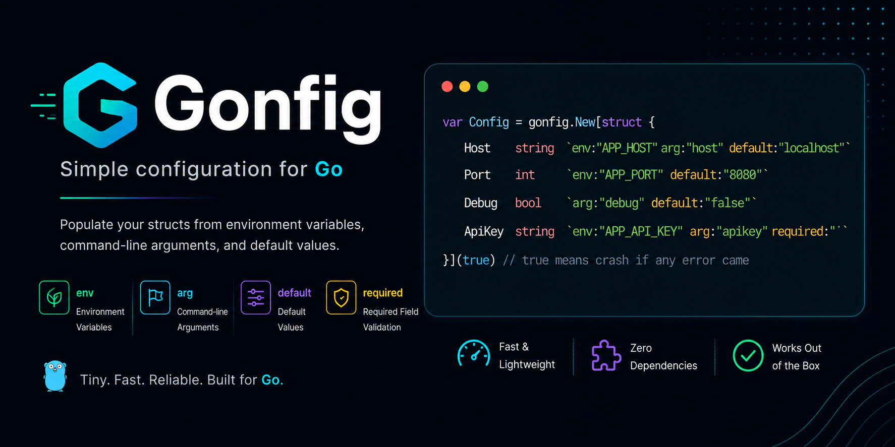

`gonfig` is a small Go library for populating struct fields from environment variables, command-line arguments, and default values.

## Table of Contents

- [Overview](#overview)
- [Usage](#usage)
- [Available Tags](#available-tags)
  - [`env`](#env)
  - [`arg`](#arg)
  - [`default`](#default)
  - [`required`](#required)
- [Behavior](#behavior)
- [Examples](#examples)
- [Notes](#notes)

## Overview

Use `gonfig.New[T](crach of issue)` to walk a struct and populate exported fields from tags.
It supports:

- `env` — read values from environment variables
- `arg` — read values from CLI flags
- `default` — populate fallback values
- `required` — validate fields are not zero values

## How to import it

Run the bellow command to import it in your project

```bash
go get github.com/vrianta/golang/gonfig/v1
```

To use this you have to import it

```go
import (
    gonfig "github.com/vrianta/golang/gonfig/v1"
)
```

## Usage

```go
package main

import (
    "fmt"
    gonfig "github.com/vrianta/golang/gonfig/v1"
)

var Flags = gonfig.New[struct {
	Host   string `env:"APP_HOST" arg:"host" default:"localhost"`
	Port   int    `env:"APP_PORT" default:"8080"`
	Debug  bool   `arg:"debug" default:"false"`
	ApiKey string `env:"APP_API_KEY" arg:"apikey" required:""`
}](true) // true means crash if any error came

func main() {
	fmt.Println(Flags.Host)
}
```

## Available Tags

### `env`

Reads a value from an environment variable.

- Syntax: `` `env:"ENV_NAME"` ``
- Behavior: if the environment variable exists and contains a value, it is parsed and assigned to the field.
- Supported target types: `string`, `bool`, signed/unsigned integers, `float32`/`float64`, and `time.Duration`.

### `arg`

Reads a value from command-line arguments.

- Syntax: `` `arg:"flag"` ``
- Supported CLI forms:
  - `--flag=value`
  - `-flag=value`
  - `--flag value`
  - `-flag value`
  - boolean flags without explicit values are treated as `true`
- Supported target types: `string`, `bool`, signed/unsigned integers, `float32`/`float64`, and `time.Duration`.

### `default`

Provides a fallback value when neither `env` nor `arg` supplies a value.

- Syntax: `` `default:"value"` ``
- Behavior: if earlier tags do not populate the field, `default` is assigned.
- Supported target types: `string`, `bool`, signed/unsigned integers, `float32`/`float64`, and `time.Duration`.

### `required`

Ensures a field has a non-zero value after parsing.

- Syntax: `` `required:"true"` `` or simply `` `required:""` ``
- Behavior: if the field remains zero-valued after parsing, `Parse` returns an error or panics when `crashOnFail` is `true`.

## Behavior

`Parse[T any](ctx *T, crashOnFail bool)` expects a non-nil pointer to a struct.

Processing order inside each struct field:

1. `env`
2. `arg`
3. `default`
4. `required`

Nested structs are processed recursively.

### Error handling

- Passing `nil` or a pointer to a non-struct returns an error.
- Unexported fields cause an error because they cannot be set by reflection.
- If `required` is present and the field is still zero-valued, `Parse` returns an error.
- If `crashOnFail` is `true`, the missing required field causes a panic instead.

## Examples

### Environment variables

```go
var Config = gonfig.New[struct {
    ApiKey string `env:"APP_API_KEY" required:"true"`
    Host   string `env:"APP_HOST" default:"localhost"`
}](true)
```

If `APP_API_KEY` is set and `APP_HOST` is not, the result is:

- `ApiKey` from environment
- `Host` = `localhost`

### Command-line arguments

```go
var Config = gonfig.New[struct {
    Verbose bool `arg:"verbose" default:"false"`
}](true)
```

Supported CLI forms:

- `./app --verbose`
- `./app --verbose=true`
- `./app -verbose true`

### Default values

```go
var Config = gonfig.New[struct {
    Mode string `default:"production"`
}](true);
```

If no `env` or `arg` value is provided, `Mode` becomes `production`.

### Required fields

```go
var Config = gonfig.New[struct {
    ApiKey string `env:"APP_API_KEY" required:"true"`
}](true)
```

If `APP_API_KEY` is missing, `Parse(cfg, false)` returns an error.

## Notes

- Tag processing only affects exported struct fields.
- `time.Duration` strings must use Go duration syntax, e.g. `"30s"` or `"5m"`.
- If both `env` and `arg` are configured for a field, the library tries `env` first, then `arg`, then `default`.
- `required` validation is evaluated after all tag parsing.
