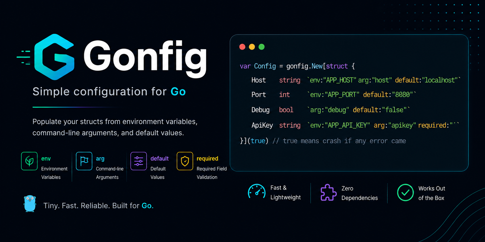

`gonfig` is a small Go configuration library for populating Go struct fields from environment variables, command-line arguments, and default values.

## Table of Contents

- [Overview](#overview)
- [Quick start](#quick-start)
- [Available Tags](#available-tags)
  - [`env`](#env)
  - [`arg`](#arg)
  - [`default`](#default)
    - [`required`](#required)
    - [`description`](#description)
- [Behavior](#behavior)
- [Command-line help](#command-line-help)
- [Examples](#examples)
- [Notes](#notes)

## Overview

Use `gonfig.New[T](crashOnFail)` to create a configuration value and populate its exported fields from tags. Use `gonfig.Parse` when your application needs to handle errors explicitly.
It supports:

- `env` — read values from environment variables
- `arg` — read values from CLI flags
- `default` — populate fallback values
- `required` — validate fields are not zero values
- `description` — add field descriptions to generated help output

See the [Wiki](https://github.com/vrianta/gonfig/wiki) for more detailed documentation.

## How to import it

Install the v1 package with:

```bash
go get github.com/vrianta/gonfig/v1@v1.1.0
```

Import it in your Go code with:

```go
import (
    gonfig "github.com/vrianta/gonfig/v1"
)
```

## Quick start

```go
package main

import (
    "fmt"
    gonfig "github.com/vrianta/gonfig/v1"
)

func main() {
    cfg := gonfig.New[struct {
        Host   string `env:"APP_HOST" arg:"host" default:"localhost"`
        Port   int    `env:"APP_PORT" default:"8080"`
        Debug  bool   `arg:"debug" default:"false"`
        APIKey string `env:"APP_API_KEY" required:"true"`
    }](true)

    fmt.Println(cfg.Host, cfg.Port, cfg.Debug)
}
```

The `true` argument makes a missing required field panic. Set it to `false` and use `Parse` when you want to handle the returned error yourself.

## Available Tags

### `env`

Reads a value from an environment variable.

- **Syntax**: `` `env:"ENV_NAME"` ``
- **Behavior**: if the environment variable exists and contains a value, it is parsed and assigned to the field.
- Supported target types include `string`, `bool`, signed/unsigned integers, `float32`, `float64`, `time.Duration`, and pointers to these types.

### `arg`

Reads a value from command-line arguments.

- **Syntax**: `` `arg:"flag"` ``
- Supported CLI forms:
  - `--flag=value`
  - `-flag=value`
  - `--flag value`
  - `-flag value`
  - boolean flags without explicit values are treated as `true`
- Supported target types include `string`, `bool`, signed/unsigned integers, `float32`, `float64`, `time.Duration`, and pointers to these types.

### `default`

Provides a fallback value when neither `env` nor `arg` supplies a value.

- **Syntax**: `` `default:"value"` ``
- **Behavior**: if earlier tags do not populate the field, `default` is assigned.
- Supported target types include `string`, `bool`, signed/unsigned integers, `float32`, `float64`, `time.Duration`, and pointers to these types.

### `required`

Ensures a field has a non-zero value after parsing.

- **Syntax**: `` `required:"true"` `` or simply `` `required:""` ``
- **Behavior**: if the field remains zero-valued after parsing, `Parse` returns an error or panics when `crashOnFail` is `true`.

### `description`

Provides inline documentation for a configuration option.

- **Syntax**: `` `description:"Detailed field description"` ``
- **Behavior**: attaches descriptive help text to the field, which is rendered in the CLI help table when `--help` or `-help` is passed.
- **Supported target types**: applicable to any struct field.

## Behavior

`Parse[T any](ctx *T, crashOnFail bool)` expects a non-nil pointer to a struct.

For each exported, non-struct field, values are resolved in this order:

1. `env`
2. `arg`
3. `default`
4. `required`

`description` is metadata used only for help output. Nested structs are processed recursively. Pointer fields are allocated when a value is supplied and remain nil when no value is supplied.

### Error handling

- Passing `nil` or a pointer to a non-struct returns an error.
- Unexported fields cause an error because they cannot be set by reflection.
- If `required` is present and the field is still zero-valued, `Parse` returns an error.
- If `crashOnFail` is `true`, the missing required field causes a panic instead.

`New` returns a value of type `T` and does not return an error. Use `Parse(&cfg, false)` when parsing errors must be handled explicitly.

## Command-line help

Passing `-help` or `--help` prints a table containing field names, flags, environment variables, defaults, required status, and descriptions.

```shell
./app --help
```

Supported argument forms include `--flag=value`, `--flag value`, `-flag=value`, `-flag value`, and boolean flags such as `--debug`.

## Examples

### Environment variables

```go
var Config = gonfig.New[struct {
    APIKey string `env:"APP_API_KEY" required:"true"`
    Host   string `env:"APP_HOST" default:"localhost"`
}](true)
```

If `APP_API_KEY` is set and `APP_HOST` is not, the result is:

- `APIKey` from environment
- `Host` = `localhost`

### Command-line arguments

```go
var Config = gonfig.New[struct {
    Verbose bool `arg:"verbose" default:"false"`
}](true)
```

Supported CLI forms:

- `./app --verbose`
- `./app --verbose=true`
- `./app -verbose true`
- `./app -verbose=true`

### Default values

```go
var Config = gonfig.New[struct {
    Mode string `default:"production"`
}](true)
```

If no `env` or `arg` value is provided, `Mode` becomes `production`.

### Required fields

```go
var Config = gonfig.New[struct {
    APIKey string `env:"APP_API_KEY" required:"true"`
}](true)
```

If `APP_API_KEY` is missing, `Parse(cfg, false)` returns an error.

## Notes

- Tag processing only affects exported struct fields.
- `time.Duration` strings must use Go duration syntax, e.g. `"30s"` or `"5m"`.
- If both `env` and `arg` are configured for a field, the library tries `env` first, then `arg`, then `default`.
- `required` validation is evaluated after all tag parsing.
- `ParseOSArgs` scans command-line arguments once and caches the results.
